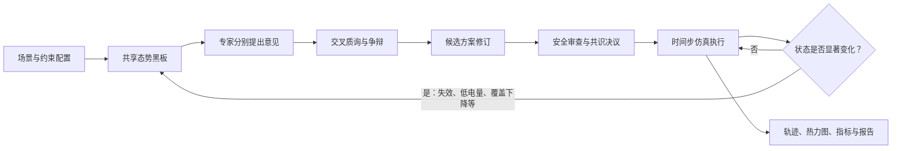

# 抽象复杂环境下无人机集群多智能体协同管控仿真

[](https://github.com/wangzhengli0327-lgtm/drone-swarm-multi-agent-simulation/actions/workflows/ci.yml)


一个面向课程研究与教学展示的多智能体协同规划原型。项目在 `60 x 60` 抽象网格中模拟无人机集群执行区域持续覆盖任务，重点展示：

- 多个领域专家智能体如何读取同一份共享态势；
- 智能体如何提出方案、相互质询、修订候选并完成安全审查；
- 仿真如何根据覆盖缺口、能量状态与随机失效事件触发动态重规划；
- 规划结果如何转化为可解释的任务分配、抽象轨迹、覆盖热力图和会议记录。

> [!IMPORTANT]
> 本项目只进行抽象仿真，不连接真实无人机，不使用真实地理坐标，也不生成真实飞控或部署指令。它不能用于真实任务规划、目标选择、武器使用或规避现实防御系统。

## 项目亮点

- **可解释的多智能体会议**：展示专家意见、交叉质询、方案修订、安全审查、最终决议与会议纪要。
- **动态而非一次性规划**：UAV 失效、低电量、覆盖下降、覆盖停滞和风险收益变化均可触发重新会商。
- **双覆盖指标**：支持累计覆盖率与滚动覆盖率，两种指标对应不同的资源调度倾向。
- **风险与收益权衡**：规划器会结合抵达时间、任务缺口、资源余量与近期损失调整风险姿态。
- **完整的可视化结果**：包含飞行轨迹、建议落点、时间轴回放、覆盖热力图、事件时间线和单机任务说明。
- **离线优先**：纯规则模式不依赖网络或模型 API，可用于稳定演示和可复现实验。
- **可选模型实验**：支持 OpenAI 兼容的 `/chat/completions` 接口，用于辅助评审或决策实验。

## 协同闭环



项目中的专家角色包括协调、场景研判、集群状态、覆盖评估、任务分配、路径规划和安全审查。所有角色读取同一份结构化态势，但从各自职责出发评价候选计划。

## 快速开始

### 环境要求

- Python 3.10 或更高版本；
- Windows、macOS 或 Linux；
- 推荐使用虚拟环境。

### 安装

```bash
git clone https://github.com/wangzhengli0327-lgtm/drone-swarm-multi-agent-simulation.git
cd drone-swarm-multi-agent-simulation
python -m venv .venv
```

Windows PowerShell：

```powershell
.\.venv\Scripts\Activate.ps1
python -m pip install --upgrade pip
pip install -r requirements.txt
```

macOS 或 Linux：

```bash
source .venv/bin/activate
python -m pip install --upgrade pip
pip install -r requirements.txt
```

### 启动

```bash
python -m streamlit run app/drone_swarm_workbench.py
```

Windows 用户也可以双击 `run_app.bat`。Streamlit 默认会在浏览器中打开 `http://localhost:8501`。

## 运行模式

| 模式 | 是否需要网络 | 决策方式 | 推荐用途 |
| --- | --- | --- | --- |
| 纯规则模式 | 否 | 启发式候选生成、规则评审与硬约束检查 | 课堂展示、录屏、回归测试 |
| 大模型辅助评审 | 是 | 模型提供解释和评审，规则评分决定最终方案 | 研究模型建议如何影响会商 |
| 大模型决策实验 | 是 | 模型推荐候选，推荐结果仍需通过覆盖与风险约束 | 探索结构化模型决策 |

首次运行建议选择“纯规则模式”和“均衡巡逻演示”预设。该预设使用 8 架 UAV、3 个任务区、120 个时间步、累计覆盖率主指标和一个高风险区。目标覆盖率只是参考线，仿真会持续到设定的最大时间步。

## 模型接口

模型模式支持 OpenAI 兼容的 `/chat/completions` 接口。可在应用界面中设置提供商、Base URL、模型名称和 API Key，也可参考 `.env.example` 准备本地环境变量。

请勿将真实 API Key 写入源码、README、截图、输出报告或 Git 历史。`.env` 已被 `.gitignore` 排除；若密钥曾出现在公开记录中，应立即在服务商后台撤销并轮换。

连接测试只发送一条很短的 JSON 请求。正式仿真需要提交完整共享态势和候选方案，重规划会议也可能再次调用模型，因此响应时间通常明显长于连接测试。现场演示建议优先使用纯规则模式。

详细配置见 [API 接入说明](docs/api-integration.md)。

## 项目结构

```text
.
├── app/
│   ├── drone_swarm_workbench.py  # Streamlit 入口与仿真工作台
│   └── drone_sim/                # 会议、场景、数据模型与 API 客户端
├── docs/                         # 架构、运行、接口和角色说明
├── outputs/reports/              # 本地生成的报告目录
├── tests/                        # 基础回归测试
├── .github/workflows/ci.yml      # GitHub Actions
├── requirements.txt
└── run_app.bat
```

## 测试

安装开发依赖并运行：

```bash
pip install -r requirements-dev.txt
python -m compileall app
python -m pytest -q
```

每次推送和 Pull Request 都会通过 GitHub Actions 执行编译检查与基础测试。

## 文档

- [架构与多智能体闭环](docs/architecture.md)
- [安装、运行与演示指南](docs/run-guide.md)
- [模型 API 接入说明](docs/api-integration.md)
- [专家角色与提示词](docs/agent-prompts.md)
- [安全策略](SECURITY.md)

## 已知限制

- 当前规划器使用启发式候选生成和综合评分，不保证数学意义上的全局最优。
- 模型模式在每场会议中执行一次结构化模型调用，不等同于多个独立模型进程长期自治运行。
- 高风险区失效是抽象概率事件，不代表任何真实环境、平台性能或对抗结果。
- 仿真结果会受到场景参数、随机种子、资源数量和风险事件影响。
- 当前项目是机制验证原型，不代表真实系统的可用性、可靠性或部署能力。

## 参与贡献

欢迎通过 Issue 提交以下内容：

- 可复现的缺陷与界面问题；
- 抽象场景、覆盖指标或会议机制的改进建议；
- 文档、测试和跨平台运行问题；
- 不涉及真实控制、目标选择或武器化的教学研究想法。

提交 Pull Request 前，请确保修改范围清晰、未包含 API Key 或生成报告，并执行：

```bash
python -m compileall app
python -m pytest -q
```

## 许可证

当前仓库尚未附加开源许可证。源代码公开可见不等于已经授权复制、修改或分发；在许可证确定前，默认保留全部权利。
