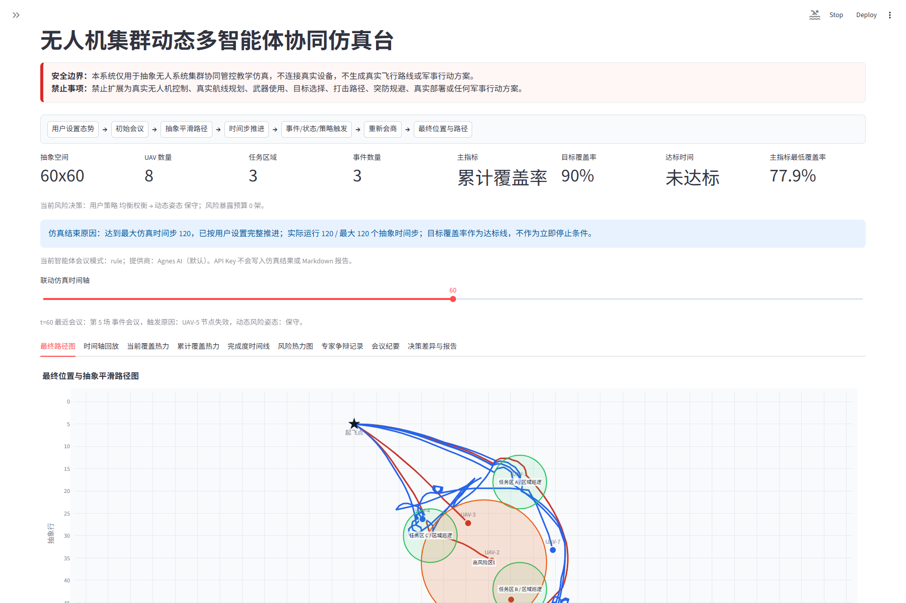
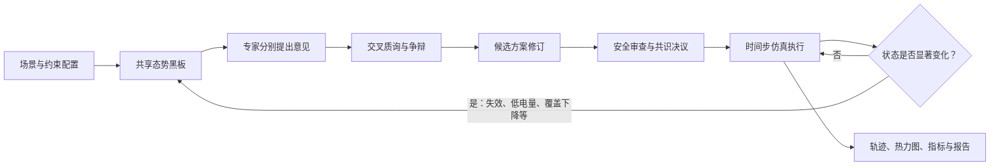

# 抽象复杂环境下无人机集群多智能体协同管控仿真

[](https://github.com/wangzhengli0327-lgtm/drone-swarm-multi-agent-simulation/actions/workflows/ci.yml)
[](https://github.com/wangzhengli0327-lgtm/drone-swarm-multi-agent-simulation/releases/latest)
[](https://drone-swarm-multi-agent-simulation.streamlit.app/)


一个面向课程研究与教学展示的多智能体协同规划原型。项目在 `60 x 60` 抽象网格中模拟无人机集群执行区域持续覆盖任务，重点展示：

- 多个领域专家智能体如何读取同一份共享态势；
- 智能体如何提出方案、相互质询、修订候选并完成安全审查；
- 仿真如何根据覆盖缺口、能量状态与随机失效事件触发动态重规划；
- 规划结果如何转化为可解释的任务分配、抽象轨迹、覆盖热力图和会议记录。

> [!IMPORTANT]
> 本项目只进行抽象仿真，不连接真实无人机，不使用真实地理坐标，也不生成真实飞控或部署指令。它不能用于真实任务规划、目标选择、武器使用或规避现实防御系统。

## 界面预览



图中展示一次纯规则模式的可复现运行：系统完成 120 个抽象时间步，记录节点失效事件与动态风险姿态，并输出任务区、风险区、UAV 抽象平滑路径和覆盖指标。截图仅代表一个教学样例，不代表真实环境或平台性能。

无需安装 Python，可直接打开[公开在线演示](https://drone-swarm-multi-agent-simulation.streamlit.app/)。首次访问若应用处于休眠状态，Streamlit Community Cloud 可能需要短暂唤醒；建议先使用“纯规则模式”体验完整流程。

## 项目亮点

- **可解释的多智能体会议**：展示专家意见、交叉质询、方案修订、安全审查、最终决议与会议纪要。
- **动态而非一次性规划**：UAV 失效、低电量、覆盖下降、覆盖停滞和风险收益变化均可触发重新会商。
- **双覆盖指标**：支持累计覆盖率与滚动覆盖率，两种指标对应不同的资源调度倾向。
- **风险与收益权衡**：规划器会结合抵达时间、任务缺口、资源余量与近期损失调整风险姿态。
- **完整的可视化结果**：包含飞行轨迹、建议落点、时间轴回放、覆盖热力图、事件时间线和单机任务说明。
- **离线优先**：纯规则模式不依赖网络或模型 API，可用于稳定演示和可复现实验。
- **可选模型实验**：支持 OpenAI 兼容的 `/chat/completions` 接口，用于辅助评审或决策实验。

## 为什么在这个问题中使用多智能体

集群覆盖规划同时包含多个相互制约的目标：覆盖范围要尽可能大，各任务区之间不能严重失衡，UAV 需要及时抵达服务位置，同时还要控制风险暴露、保留可用节点并应对突发失效。把所有目标压缩成一次不透明的单一计算，很难解释“为什么选择这条路径”以及“为什么在状态变化后改变策略”。

本项目将规划过程拆分为多个专家视角。每个智能体只负责一类判断，并通过共享态势黑板交换证据：

| 智能体 | 中文定位 | 主要输入 | 主要职责 |
| --- | --- | --- | --- |
| `CoordinatorAgent` | 协调决策专家 | 全部意见、候选评分与审查结果 | 组织会议、归纳争议并形成最终决议 |
| `ScenarioAgent` | 场景研判专家 | 任务区、高风险区及其几何关系 | 解释场景约束，检查任务区是否获得服务 |
| `SwarmStatusAgent` | 集群状态专家 | UAV 状态、剩余电量和历史失效 | 判断当前可用资源与持续执行能力 |
| `CoverageAssessmentAgent` | 覆盖评估专家 | 当前热力图、累计/滚动覆盖明细 | 寻找覆盖缺口，评价边际覆盖收益 |
| `TaskAllocationAgent` | 任务分配专家 | 可用 UAV、任务压力和候选服务点 | 分配资源，控制任务区之间的覆盖失衡 |
| `PathPlanningAgent` | 路径规划专家 | 起点、服务点、抵达时间和风险代价 | 生成抽象平滑轨迹，比较较短路径与风险避让 |
| `SafetyReviewAgent` | 安全审查专家 | 风险姿态、风险预算和候选暴露量 | 标记超预算方案、提出反对意见并增加风险惩罚 |

多智能体在这里不是为了简单地“让多个角色各说一句话”，而是为了形成一个可检查的决策链：每项意见要引用共享状态，每个候选要接受其他角色质询，最终方案还要进入仿真接受时间步反馈。

## 协同闭环



### 一场会议如何形成决议

1. **读取共享态势**：会议读取任务区覆盖、UAV 可用数量、低电量与失效节点、近期损失、动态风险姿态、风险预算和历史事件。
2. **分别提出专业意见**：各智能体从覆盖、时间、资源、风险与均衡角度描述问题，并给出带证据的建议。
3. **生成竞争候选**：系统同时构建覆盖优先、安全优先、抵达时间优先和任务均衡四类方案，而不是只生成一个结果。
4. **相互质询**：覆盖专家检查最低预计覆盖，安全专家检查风险预算，路径专家检查平均距离，任务分配专家检查覆盖离散度。
5. **修订方案**：如果首选候选风险超预算，或最低预计覆盖存在严重缺口，协调智能体会生成“质询后共识修正版”。
6. **约束选案**：系统综合最低覆盖、平均覆盖、覆盖均衡、风险暴露、风险总量和移动距离进行评分。模型推荐也必须通过覆盖与风险硬约束。
7. **写入执行层**：入选方案被转换为每架 UAV 的抽象任务、服务位置、抵达时间和完整轨迹。
8. **接收反馈**：时间步仿真持续更新覆盖、能量和节点状态；满足触发条件时，新的共享态势进入下一场会议。

### 共享态势与决策产物

```text
共享态势黑板
├── 任务区：位置、半径、覆盖缺口
├── 集群：可用、低电量、失效 UAV
├── 指标：累计覆盖、滚动覆盖、目标参考线
├── 风险：高风险区、近期损失、动态姿态、暴露预算
└── 历史：事件、会议与上一轮决议

会议决策
├── 专家意见与证据
├── 多个候选方案及量化指标
├── 交叉审查与保留意见
├── 入选候选及选择理由
└── 单机任务、建议位置与抽象轨迹
```

### 实时状态如何改变策略

用户选择的“安全优先、均衡权衡、覆盖优先”是初始倾向，并不把规划器永久锁定在一种行为上。系统会根据实时状态计算保守、均衡或进取的动态风险姿态：

- 在滚动覆盖模式下，如果近期已有节点在高风险区失效，或剩余 UAV 已接近任务区数量，安全审查会强调持续服务能力，降低风险暴露预算，避免资源连续损失。
- 在累计覆盖模式下，如果较长时间没有风险损失且覆盖提升停滞，会议可以讨论适度增加风险预算，以探索仍未覆盖的区域。
- 当累计覆盖已经较高、但滚动覆盖明显下降时，系统会把它识别为“历史上覆盖过、当前却无法持续覆盖”，并触发策略评审会议。
- 当任务区之间长期失衡、最低覆盖持续不足、滚动覆盖下降或动态风险姿态需要变化时，即使没有 UAV 被摧毁，也可以召开状态修正或策略评审会议。

这些规则体现的是“用户策略 + 实时证据 + 专家制衡”的决策方式，而不是固定地选择绕行或穿越高风险区。

## 多智能体实现边界

本项目采用**单进程、角色化、共享黑板式多智能体架构**。不同专家拥有明确职责、意见结构和审查关系，但它们并不是多个长期运行、各自拥有独立记忆和工具的大模型进程。

- 在纯规则模式下，各角色由确定性的领域规则生成意见、候选与审查结果。
- 在模型模式下，每场会议最多进行一次结构化模型调用，由模型返回多个合法角色的意见、审查和推荐。
- 模型输出需要通过字段校验；模型推荐还必须通过覆盖与风险硬约束。
- 模型请求失败时，系统会记录失败状态并回退到规则决策，不让 API 可用性破坏仿真主流程。

这种设计适合课堂演示、机制验证和可重复比较。若要研究更强的自治能力，可以在此基础上继续拆分独立智能体执行器、角色记忆、工具调用权限和多轮消息调度，但仍应保持本项目的抽象仿真安全边界。

## 快速开始

### 环境要求

- Python 3.10 或更高版本；
- Windows、macOS 或 Linux；
- 推荐使用虚拟环境。

### 安装

```bash
git clone https://github.com/wangzhengli0327-lgtm/drone-swarm-multi-agent-simulation.git
cd drone-swarm-multi-agent-simulation
python -m venv .venv
```

Windows PowerShell：

```powershell
.\.venv\Scripts\Activate.ps1
python -m pip install --upgrade pip
pip install -r requirements.txt
```

macOS 或 Linux：

```bash
source .venv/bin/activate
python -m pip install --upgrade pip
pip install -r requirements.txt
```

### 启动

```bash
python -m streamlit run app/drone_swarm_workbench.py
```

也可以使用云端兼容入口：

```bash
python -m streamlit run streamlit_app.py
```

Windows 用户还可以双击 `run_app.bat`。Streamlit 默认会在浏览器中打开 `http://localhost:8501`。

## 运行模式

| 模式 | 是否需要网络 | 决策方式 | 推荐用途 |
| --- | --- | --- | --- |
| 纯规则模式 | 否 | 启发式候选生成、规则评审与硬约束检查 | 课堂展示、录屏、回归测试 |
| 大模型辅助评审 | 是 | 模型提供解释和评审，规则评分决定最终方案 | 研究模型建议如何影响会商 |
| 大模型决策实验 | 是 | 模型推荐候选，推荐结果仍需通过覆盖与风险约束 | 探索结构化模型决策 |

首次运行建议选择“纯规则模式”和“均衡巡逻演示”预设。该预设使用 8 架 UAV、3 个任务区、120 个时间步、累计覆盖率主指标和一个高风险区。目标覆盖率只是参考线，仿真会持续到设定的最大时间步。

## 可以开展的实验

本仓库适合用于比较机制，而不是追求单次运行中的“最好看结果”。可以固定随机种子，只改变一个变量进行对照：

| 实验问题 | 建议对照变量 | 观察结果 |
| --- | --- | --- |
| 累计覆盖与持续覆盖有何差异？ | 累计覆盖率 / 滚动覆盖率 | 各任务区覆盖曲线、重规划次数、最终可用 UAV |
| 初始风险偏好是否会被实时状态修正？ | 安全 / 均衡 / 覆盖优先 | 动态风险姿态、风险预算、失效事件 |
| 高风险区如何影响路径和任务分配？ | 区域位置、半径、失效概率 | 路径风险代价、抵达时间、覆盖恢复速度 |
| 资源不足时如何保持任务公平？ | UAV 数量、任务区数量、初始低电量数量 | 最低任务区覆盖、覆盖离散度 |
| 模型建议是否优于规则候选？ | 纯规则 / 模型辅助 / 模型决策 | 候选评分、模型推荐、硬约束拦截记录 |
| 多智能体审查是否有价值？ | 完整审查 / 移除某类评价指标 | 风险暴露、覆盖缺口、共识修正触发次数 |

为保证实验可解释，建议记录场景参数、随机种子、运行模式和模型信息，并通过事件时间线与会议纪要说明结果产生的原因。

## 模型接口

模型模式支持 OpenAI 兼容的 `/chat/completions` 接口。可在应用界面中设置提供商、Base URL、模型名称和 API Key，也可参考 `.env.example` 准备本地环境变量。

请勿将真实 API Key 写入源码、README、截图、输出报告或 Git 历史。`.env` 已被 `.gitignore` 排除；若密钥曾出现在公开记录中，应立即在服务商后台撤销并轮换。

连接测试只发送一条很短的 JSON 请求。正式仿真需要提交完整共享态势和候选方案，重规划会议也可能再次调用模型，因此响应时间通常明显长于连接测试。现场演示建议优先使用纯规则模式。

详细配置见 [API 接入说明](docs/api-integration.md)。

## 项目结构

```text
.
├── app/
│   ├── drone_swarm_workbench.py  # Streamlit 入口与仿真工作台
│   └── drone_sim/                # 会议、场景、数据模型与 API 客户端
├── docs/                         # 架构、运行、接口和角色说明
├── outputs/reports/              # 本地生成的报告目录
├── tests/                        # 基础回归测试
├── .github/workflows/ci.yml      # GitHub Actions
├── requirements.txt
├── streamlit_app.py              # Streamlit Community Cloud 入口
└── run_app.bat
```

核心扩展位置：

- `app/drone_sim/meeting_engine.py`：专家意见、候选类型、综合评分、交叉审查和选案逻辑；
- `app/drone_sim/models.py`：仿真配置与智能体消息数据结构；
- `app/drone_sim/llm_agents.py`：结构化模型会议及返回值校验；
- `app/drone_sim/llm_provider.py`：OpenAI 兼容 API 客户端；
- `app/drone_sim/scenario.py`：演示场景预设；
- `app/drone_swarm_workbench.py`：路径、覆盖、动态风险姿态、会议触发、时间步执行和界面展示。

## 测试

安装开发依赖并运行：

```bash
pip install -r requirements-dev.txt
python -m compileall app
python -m pytest -q
```

每次推送和 Pull Request 都会通过 GitHub Actions 执行编译检查与基础测试。

## 文档

- [架构与多智能体闭环](docs/architecture.md)
- [安装、运行与演示指南](docs/run-guide.md)
- [模型 API 接入说明](docs/api-integration.md)
- [专家角色与提示词](docs/agent-prompts.md)
- [安全策略](SECURITY.md)

## 已知限制

- 当前规划器使用启发式候选生成和综合评分，不保证数学意义上的全局最优。
- 模型模式在每场会议中执行一次结构化模型调用，不等同于多个独立模型进程长期自治运行。
- 高风险区失效是抽象概率事件，不代表任何真实环境、平台性能或对抗结果。
- 仿真结果会受到场景参数、随机种子、资源数量和风险事件影响。
- 当前项目是机制验证原型，不代表真实系统的可用性、可靠性或部署能力。

## 参与贡献

欢迎通过 Issue 提交以下内容：

- 可复现的缺陷与界面问题；
- 抽象场景、覆盖指标或会议机制的改进建议；
- 文档、测试和跨平台运行问题；
- 不涉及真实控制、目标选择或武器化的教学研究想法。

提交 Pull Request 前，请确保修改范围清晰、未包含 API Key 或生成报告，并执行：

```bash
python -m compileall app
python -m pytest -q
```

## 许可证

本项目采用 [MIT License](LICENSE)。许可证只授予软件使用、修改和分发权，不改变本项目的教学仿真定位，也不表示作者认可任何超出安全边界的使用方式。
